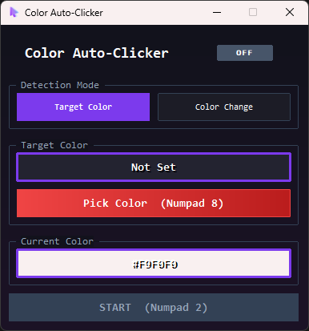

# Color Auto Clicker

A lightweight application that automatically clicks based on color detection. Features two modes: target color matching and color change detection.

Available in two versions: **Windows Native** (C++) and **Cross-Platform** (Electron).



---

## 🎯 Choose Your Version

### Windows Native (C++ / Win32 API) - Recommended for Windows

✅ **Smallest size** (~1.8 MB)
✅ **Fastest performance** (instant startup)
✅ **Zero dependencies** (single .exe)
✅ **Lowest RAM usage** (~5 MB)

**Files**: `main.cpp`, `build.bat` (root directory)
**Build**: Run `build.bat` with Visual Studio 2022

### Cross-Platform (Electron / TypeScript)

✅ **Works on Windows, macOS, Linux**
✅ **Apple Silicon support** (M1/M2)
✅ **Modern web UI** (HTML/CSS)
✅ **Easy to customize**

**Files**: `src/` directory + `package.json`
**Build**: See [BUILD.md](BUILD.md) for GitHub Actions (builds all platforms automatically)

---

## Features

### Detection Modes

1. **Target Color**: Click when a specific color is detected under cursor
2. **Color Change**: Click whenever the cursor color changes

### Interface

- Clean, modern dark design
- Real-time color display (20 updates/second)
- Visual color previews with hex values
- Always-on-top window
- Status badge (LIVE/OFF)

### Keyboard Shortcuts (Global)

- **Numpad 8**: Pick target color
- **Numpad 2**: Start/Stop detection
- **Numpad 0**: Quit application

---

## Quick Start

### Windows Native

```bash
# Build
build.bat

# Run
ColorAutoClicker.exe
```

### Cross-Platform

```bash
# Install dependencies
npm install

# Run in development
npm start

# Build for Windows
npm run dist:win

# Build all platforms (GitHub Actions)
git tag v1.0.0
git push --follow-tags
```

See [BUILD.md](BUILD.md) for complete build instructions including automated GitHub Actions builds.

---

## Usage

### Target Color Mode

1. Launch application
2. Select **"Target Color"** (default)
3. Move cursor over desired color
4. Press **Numpad 8** to sample color
5. Press **Numpad 2** to start detection
6. Move cursor - app clicks when target color found
7. Detection auto-stops after click

### Color Change Mode

1. Launch application
2. Select **"Color Change"**
3. Position cursor where monitoring starts
4. Press **Numpad 2** to start
5. Move cursor to different color
6. App clicks immediately on color change
7. Detection auto-stops after click

---

## Technical Comparison

| Feature | Windows Native | Electron |
|---------|----------------|----------|
| **Size** | ~1.8 MB | ~68 MB |
| **Startup** | <100 ms | ~2 seconds |
| **RAM** | ~5 MB | ~120 MB |
| **Detection Speed** | ~1000 Hz (1ms) | ~50 Hz (20ms) |
| **CPU (idle)** | <1% | 1-2% |
| **Platforms** | Windows only | Windows, macOS, Linux |
| **Dependencies** | None | Node.js (to build) |
| **UI Framework** | Win32 API | Electron/Chromium |

**Detection accuracy**: Identical (both use native pixel-perfect RGB matching)

---

## Building

### Windows Native (C++)

**Requirements**:
- Windows OS
- Visual Studio 2022
- C++17 compiler

**Build**:
```bash
build.bat
```

**Output**: `ColorAutoClicker.exe` (~1.8 MB)

### Cross-Platform (Electron)

**Requirements**:
- Node.js 20+
- npm

**Local build**:
```bash
npm install
npm run build
npm run dist:win  # Windows
```

**GitHub Actions** (recommended for multi-platform):
```bash
git tag v1.0.0
git push --follow-tags
# Builds Windows, macOS, Linux automatically in ~20 minutes
```

See [BUILD.md](BUILD.md) for complete instructions.

---

## Project Structure

```
color-clicker/
├── main.cpp                    # Windows native version
├── build.bat                   # Windows build script
├── app.rc                      # Windows resources
├── icon.ico                    # Application icon
├── src/                        # Electron cross-platform version
│   ├── main.ts                 # Electron main process
│   ├── renderer.ts             # UI logic
│   ├── index.html              # Interface
│   └── styles.css              # Styling
├── package.json                # Node.js dependencies
├── tsconfig.json               # TypeScript config
├── start.bat                   # Electron launcher (clears ELECTRON_RUN_AS_NODE)
├── .github/workflows/build.yml # CI/CD for all platforms
├── README.md                   # This file
└── BUILD.md                    # Build instructions
```

---

## Environment Setup (Electron)

**Important**: Electron requires the `ELECTRON_RUN_AS_NODE` environment variable to NOT be set.

**Quick fix** - Use `start.bat`:
```bash
npm start
# or
start.bat
```

**Permanent fix** - Remove the environment variable:
1. System Properties → Environment Variables
2. Delete `ELECTRON_RUN_AS_NODE` (User and System)
3. Restart terminal

---

## Use Cases

- **Gaming**: Auto-click when specific colors appear (fishing, harvesting)
- **Testing**: Automated UI testing based on visual cues
- **Monitoring**: React to status indicators or alerts
- **Macros**: Color-based automation workflows

---

## Performance Notes

Both versions:
- ✅ Pixel-perfect RGB color matching
- ✅ Auto-stop after click (one-shot mode)
- ✅ Global hotkeys (work when unfocused)
- ✅ Real-time color preview
- ✅ Same detection accuracy

**For Windows users**: Native version is recommended (instant, lightweight)
**For cross-platform**: Electron version works identically with slightly higher resource usage

---

## Troubleshooting

### Windows Native

- **Error compiling**: Install Visual Studio 2022 with C++ tools
- **Hotkeys not working**: Check no other app uses same numpad keys

### Electron

- **App won't start**: Run `start.bat` or remove `ELECTRON_RUN_AS_NODE` env var
- **"Cannot find module"**: Run `npm install && npx electron-rebuild`
- **Build failed**: See [BUILD.md](BUILD.md) troubleshooting section

---

## License

MIT License - See repository for details

## Author

Henrijs Kons

---

## Additional Resources

- **Build Guide**: [BUILD.md](BUILD.md)
- **GitHub Actions**: Automated multi-platform builds
- **Issues**: Report bugs on GitHub
